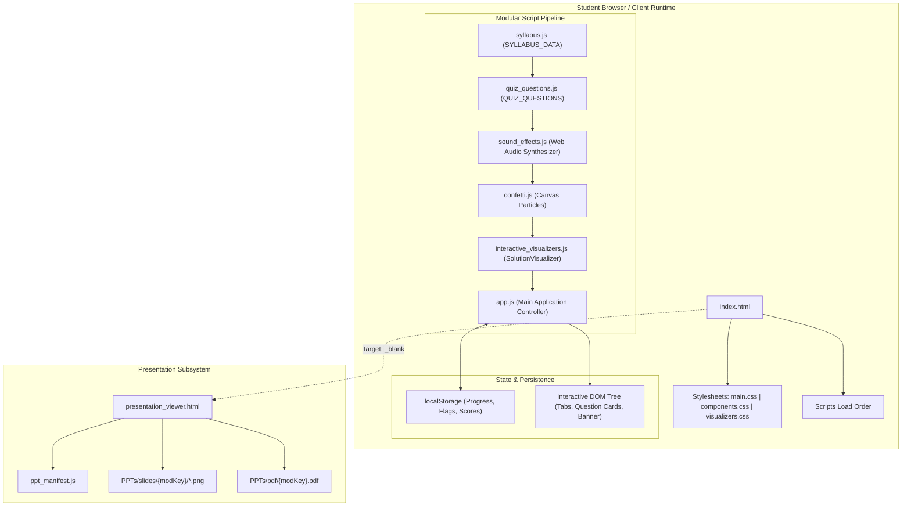
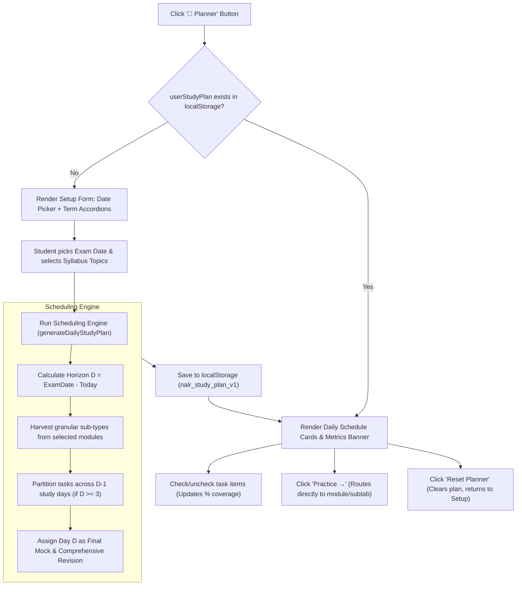

# 🏗️ ARCHITECTURE.md — System Architecture & Data Flow

This document details the software architecture, data structures, state management lifecycle, and asset pipelines of the **NALR Masterclass** platform.

---

## 1. High-Level Architectural Overview

The application follows an **Offline-First, Zero-Build Modular Vanilla Web Architecture**:



---

## 2. Script Load Order & Execution Lifecycle

The scripts MUST load sequentially in `index.html` to satisfy dependencies:

```html
<!-- Modular Load Order (Critical Dependency Order) -->
<script src="syllabus.js?v=11.0"></script>
<script src="quiz_questions.js?v=11.0"></script>
<script src="sound_effects.js?v=11.0"></script>
<script src="confetti.js?v=11.0"></script>
<script src="interactive_visualizers.js?v=11.0"></script>
<script src="app.js?v=11.0"></script>
```

1. **`syllabus.js`**: Declares global `SYLLABUS_DATA` and `SYLLABUS_MODULES`. Defines all terms (ST1, ST2, EndTerm) and subtab types.
2. **`quiz_questions.js`**: Declares global `QUIZ_QUESTIONS` array (535 verified questions across ST1).
3. **`sound_effects.js`**: Instantiates synthetic Web Audio API tone oscillators for correct chime (`800Hz $\rightarrow$ 1200Hz`) and incorrect buzz (`220Hz $\rightarrow$ 180Hz`). Zero external MP3/WAV files required.
4. **`confetti.js`**: Manages the `<canvas id="confettiCanvas">` particle physics engine for score celebrations.
5. **`interactive_visualizers.js`**: Exposes the `SolutionVisualizer` namespace containing custom rendering algorithms for all 14 syllabus topics.
6. **`app.js`**: Main event bus and application controller. Initializes state, binds DOM events, manages question rendering, calculates scores, and persists progress.

---

## 3. State Management & Lifecycle (`app.js`)

The application state is maintained in-memory and synchronized to `localStorage`:

```javascript
let currentTermId = 'st1';             // 'st1' | 'st2' | 'endterm'
let activeModuleId = 'mod1';           // Current syllabus module
let activeTypeId = 'type_1';           // Current problem-solving subtab
let activeDiffFilter = 'all';          // 'all' | 'Easy' | 'Medium' | 'Hard'
let filterFlaggedOnly = false;         // Boolean toggle for bookmarks
let userAnswers = {};                  // { [questionId]: selectedOptionText }
let flaggedQuestions = new Set();      // Set of bookmarked question IDs
let isExamMode = false;                // Practice Mode vs Continuous Exam Mode
let userStudyPlan = null;              // Personalized daily study schedule
```

### Persistence Keys (`localStorage`):
- `NALR_MULTI_TERM_APTITUDE_V8`: Practice answers, exam state, bookmarks, current term.
- `nalr_study_plan_v1`: JSON object storing `userStudyPlan` (target exam date, daily tasks, completed checkboxes).
- `nalr_theme`: String `'light'` or `'dark'`.

---

## 4. Visualizer Architecture (`interactive_visualizers.js`)

The visualizer module is structured as an IIFE returning a single entry point:
```javascript
const SolutionVisualizer = (() => {
  // Topic-specific renderers
  function renderBloodRelation(q) { ... }
  function renderCodedRelation(q) { ... }
  function renderDirectionSense(q) { ... }
  function renderAnalogy(q) { ... }
  function renderNumberSystem(q) { ... }
  function renderHcfLcm(q) { ... }
  function renderAverage(q) { ... }
  function renderRemainderTheorem(q) { ... }
  function renderRatioProportion(q) { ... }
  function renderAgesTimeline(q) { ... }
  function renderPartnership(q) { ... }
  function renderAlligation(q) { ... }
  function renderOddManOut(q) { ... }
  function renderSyllogismVenn(q) { ... }
  function renderGenericAptitude(q) { ... }

  // Master router
  function generateVisualizer(q) {
    // Routes based on q.module_id and question content
  }

  return { generateVisualizer, ... };
})();
```

When an option is selected, `app.js` invokes `SolutionVisualizer.generateVisualizer(q)` and injects the resulting HTML/SVG directly into `.solution-visualizer-dock` inside the question card.

---

## 5. Presentation Viewer Subsystem

### 5.1 Presentation Architecture
Browsers cannot render binary `.pptx` archives natively, and cloud viewers fail offline or on `localhost`. To solve this, all 13 syllabus presentations are pre-processed into two formats:
1. **High-Res Slide Images**: `PPTs/slides/{modKey}/slide_{1..N}.png` (1280×720).
2. **Vector PDF**: `PPTs/pdf/{modKey}.pdf`.

### 5.2 Dynamic PPT Button Link
In `app.js`, `updateModulePPTButton(activeModuleId)` links dynamically to:
```
presentation_viewer.html?mod={modId}&file={encodedPptPath}&title={encodedTitle}
```

### 5.3 Viewer Capabilities (`presentation_viewer.html`)
- **Pre-Built Document Viewer Engine**: Embeds browser-native presentation PDF viewer (`<iframe src="PPTs/pdf/modX.pdf#toolbar=1&navpanes=1">`) with built-in page thumbnails, text search, zoom, and fit-to-page.
- **Fullscreen Mode**: Dedicated fullscreen toggle button (`⛶ Fullscreen`).
- **Direct Download**: Top-bar action button to download the original `.pptx` file.

---

## 6. Personalized Daily Study Planner Subsystem



### 6.1 Algorithmic Guarantees
1. **Time Horizon Validation**: Exam date must be strictly $\ge \text{today} + 1$.
2. **Even Distribution**: Tasks are divided via $\lfloor N_{\text{tasks}} / D_{\text{study}} \rfloor$ with remaining modulo tasks distributed to early days.
3. **Buffer Management**: When study days exceed task count ($D > N$), surplus days are allocated as deep-dive buffer days instead of being left empty.
4. **Direct Navigation**: Clicking any daily task invokes `jumpToPlannerTopic()`, automatically closing the modal and loading the exact module and problem type subtab in Practice Mode.

### 6.2 Modal Viewport & Layout Architecture
To prevent vertical overflow when expanding syllabus accordion sections (ST-1, ST-2, End Term):
1. **Modal Container (`.planner-dialog`)**: Constrained to `max-height: 85vh` (flex column with `overflow: hidden`), strictly preventing the outer dialog from expanding beyond the browser viewport.
2. **Fixed Header (`.planner-setup-fixed-head`)**: Contains the modal header and 'Target Exam Date' card with `flex-shrink: 0`, keeping them permanently pinned at the top.
3. **Scrollable Body (`.planner-scrollable-body`)**: Wraps the middle accordion section with `flex: 1 1 0` and `overflow-y: auto`, isolating all scrolling exclusively to the syllabus tree.
4. **Sticky Footer (`.planner-footer`)**: Located outside the scrollable body with `flex-shrink: 0`, a solid background (`var(--card-bg)`), and a top border, permanently visible at the modal bottom.

---

## 7. Fluid Layout Transitions & Navigation Pipeline

### 7.1 Liquid Sliding Pill Indicator
The term switcher (`#termSelectorGroup`) utilizes a hardware-accelerated shared floating background indicator pill (`#termSlidingPill`):
- Instead of abrupt class swaps, `updateTermSelectorButtonsUI()` measures the active tab button's `offsetLeft` and `offsetWidth`.
- The pill translates via `transform: translateX(${offsetLeft}px)` and dynamic `width: ${offsetWidth}px` using `cubic-bezier(0.2, 0.9, 0.3, 1)`.
- Re-synced on window `resize` and `document.fonts.ready` events to maintain pixel-perfect alignment across display zooms.

### 7.2 Staggered Cascade Question Transitions
When moving between questions, UI components enter via micro-staggered CSS animations:
- Question Banner: `slideDown` (0ms delay)
- Question Body: `fadeIn` (40ms delay)
- Options A through D: `floatUp` (staggered sequentially at 70ms, 100ms, 130ms, 160ms)
- Provides native iOS-feel responsiveness without runtime JavaScript animation loops.

### 7.3 Zero-Jank CSS Grid Accordions
Solution and theory drawers animate utilizing modern CSS Grid layout:
```css
.exam-feedback-box {
  display: grid;
  grid-template-rows: 0fr;
  transition: grid-template-rows 0.35s cubic-bezier(0.16, 1, 0.3, 1);
}
.exam-feedback-box.expanded {
  grid-template-rows: 1fr;
}
.exam-feedback-box-content {
  overflow: hidden;
  min-height: 0;
}
```
This avoids legacy `max-height` estimation hacks, delivering jank-free 60 FPS transitions.

---

## 8. Dynamic Cursor Spotlight & Smooth Theme Engine

### 8.1 Specular Cursor Spotlight
- A global `pointermove` listener captures cursor coordinates `(clientX, clientY)`.
- Updates CSS custom properties `--mouse-x` and `--mouse-y` on cards (`.exam-question-card`, `.study-card-main`, `.tab-question-item`).
- High-efficiency rendering using CSS mask composition:
  ```css
  mask: linear-gradient(#fff 0 0) content-box, linear-gradient(#fff 0 0);
  mask-composite: exclude;
  ```
- Throttled via `requestAnimationFrame` to eliminate main-thread stuttering during fast cursor movement.

### 8.2 Smooth Circular Ripple Theme Transition
- The theme toggle invokes `applyThemeChange(newTheme, clickX, clickY)`.
- If supported, invokes the browser `document.startViewTransition()`.
- Dynamically generates a expanding circular mask clip-path:
  ```javascript
  document.documentElement.animate({
    clipPath: [
      `circle(0px at ${x}px ${y}px)`,
      `circle(${maxRadius}px at ${x}px ${y}px)`
    ]
  }, {
    duration: 480,
    easing: "cubic-bezier(0.16, 1, 0.3, 1)",
    pseudoElement: "::view-transition-new(root)"
  });
  ```
- Degrades gracefully with radial clip-path mask on non-supporting browsers.

---

## 9. GPU Hardware Acceleration & Compositor Virtualization

To ensure smooth 60+ FPS performance even on low-powered mobile devices or large high-refresh monitors:
1. **Decoupled Fixed Background Plane**:
   - Replaced `background-attachment: fixed` on `body` (which triggers full-page layout repaints on scroll) with a dedicated pseudo-element:
   ```css
   body::before {
     content: "";
     position: fixed;
     inset: 0;
     z-index: -1;
     transform: translateZ(0);
     will-change: transform;
   }
   ```
2. **GPU Layer Promotion**:
   - Promoted key cards, SVGs, and sliding pills to independent compositor layers via `transform: translateZ(0)` and `backface-visibility: hidden`.
3. **Layout & Paint Containment**:
   - Applied `contain: layout style paint` to self-contained components (`.sol-vis-container`, `.planner-day-card`, `.exam-question-card`).
4. **DOM Virtualization via `content-visibility: auto`**:
   - Applied `content-visibility: auto` with `contain-intrinsic-size` to long list rows (e.g. `.results-detail-row`, `.planner-day-card`), skipping off-screen layout and paint until scrolled into viewport.
5. **Event Loop Throttling**:
   - `pointermove` and `scroll` event listeners are RAF-batched (`requestAnimationFrame`) with passive flag `{ passive: true }`.


